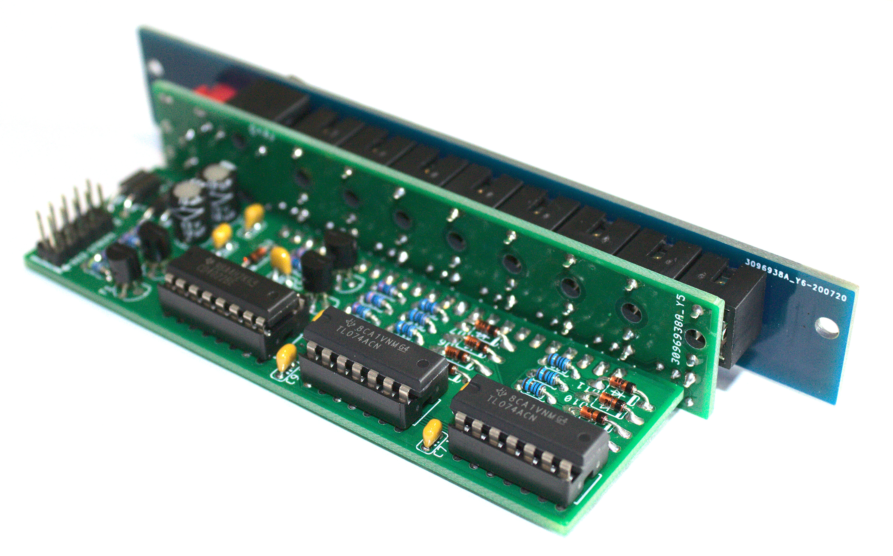

# 1 2 3

## 8 steps resettable sequencial clock in 4 hp

With a clock going into the CLK input output 1 to 8 will go high one at a time. A reset input or a button can reset the sequence back to the 1st step. The outputs are designed to be mixed with simple passive multiples. No need for additional OR logic / gate combiner. For example, try to connect output 1 and 3 to a passive multiple or stackable and also to a kick drum trigger input, and output 5 and 8 in a similar fashion to a snare trigger input. Got the idea? The module can also work in audio rate to produce various sub-octaves and sync effects.

## Specs

- Width: 4hp
- Depth: 44mm
- Power: 29mA @ 12V / 16mA @ -12V

## Useful references

- [Ken Stone's gate sequencer](https://www.elby-designs.com/webtek/cgs/cgs89/cgs89_gate_sequencer.html)
- [Ken Stone's gate to trigger](https://www.muffwiggler.com/forum/viewtopic.php?t=46926)
- [Passive OR logic](https://forum.aemodular.com/thread/365/diy-project-02-passive-logic)
- [Non inverting transistor switch](http://www.timstinchcombe.co.uk/index.php?pge=a161)
- [4022 datasheet](https://www.ti.com/lit/ds/symlink/cd4022b.pdf)
- [Reset input simulation](http://www.falstad.com/circuit/circuitjs.html?cct=$+0+0.000005+0.9487735836358526+50+5+43%0Ar+96+240+96+288+0+100000%0Ar+240+240+240+288+0+100000%0Ag+240+304+240+320+0%0Ag+304+304+304+320+0%0AR+304+96+304+64+0+0+40+12+0+0+0.5%0At+272+224+304+224+0+1+-9.770126409985263+0.5279543655005605+100%0Ar+304+96+304+144+0+10000%0Ar+336+192+400+192+0+100000%0Ag+432+304+432+320+0%0AR+432+96+432+64+0+0+40+12+0+0+0.5%0Aw+304+192+336+192+0%0Aw+304+176+304+192+0%0Aw+304+208+304+192+0%0AO+464+160+496+160+0%0Aw+432+160+464+160+0%0At+400+192+432+192+0+1+0.5312969859863312+0.6035068512629786+100%0Ar+432+96+432+144+0+10000%0Aw+432+144+432+160+0%0Aw+432+160+432+176+0%0Ad+160+288+160+240+2+default%0Ac+112+224+144+224+0+1e-8+-0.5880744193515561%0Ag+160+304+160+320+0%0Ag+96+304+96+320+0%0Aw+304+240+304+304+0%0Aw+432+208+432+304+0%0Aw+240+288+240+304+0%0Aw+96+288+96+304+0%0Aw+96+224+96+240+0%0Aw+96+224+112+224+0%0Aw+144+224+160+224+0%0Aw+224+224+240+224+0%0Aw+240+224+272+224+0%0Aw+304+144+304+176+0%0AR+96+224+96+176+0+2+1000+3+3+0+0.5%0Aw+160+288+160+304+0%0Aw+240+224+240+240+0%0Aw+160+224+160+240+0%0Ar+176+224+224+224+0+10000%0Aw+160+224+176+224+0%0Ao+13+1+0+4098+20+0.1+0+1%0A)
- [LED calculator](http://ledcalc.com/)

