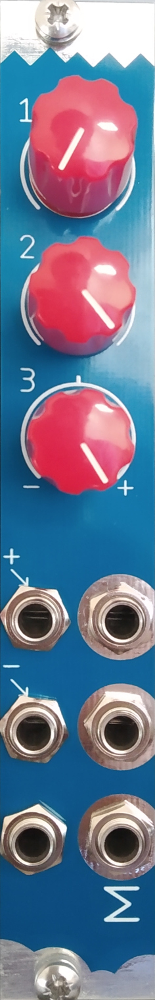

# I M smart

## Utility mixer with some nice extras in 4 hp

- 3 channels mixer
- 2 attenuators
- 1 attenuverter
- Positive and negative manual voltages

## Specs

- Width: 4hp
- Depth: 25mm
- Power: 5mA @ 12V / 5mA @ -12V
