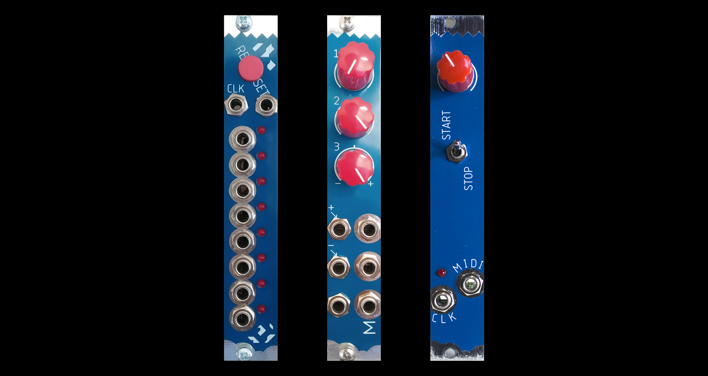

# Some eurorack modules

I'm trying. Let's see where it goes.

# Modules

- [1 2 3](<1 2 3/README.md>) - 8 steps resettable sequencial clock
- [I M smart](<I M smart/README.md>) - Utility mixer with some nice extras
- [let's play together](<lets play together/README.md>) - Analog + MIDI clock source

## Resources

- [Music Thing Modular parts library](https://github.com/TomWhitwell/MTM-Parts-Library).
