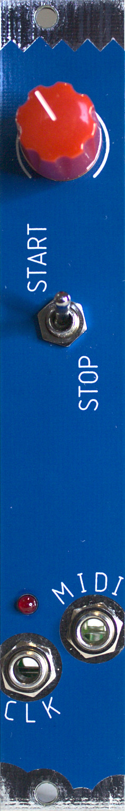
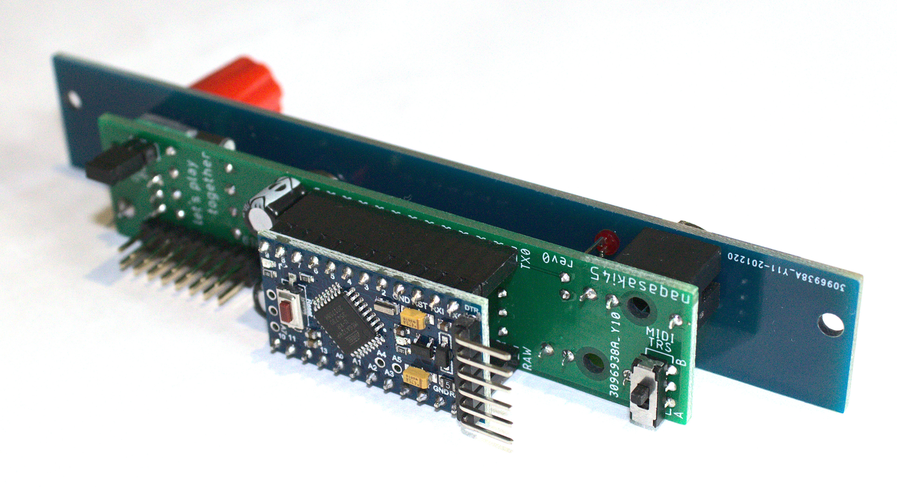

# let's play together

## Analog + MIDI clock source in 4 hp

A clock module to sync your eurorack and external MIDI gear. The analog clock at the `CLK` output always ticks and the MIDI clock has a switch to start and stop that send the appropriate MIDI messages when flicked either side. There's a jumper at the back to send the analog clock to the gate bus, if you want to minimise cables to your other clocked modules.

### Summary of features

- Analog + MIDI clock
- MIDI start and stop toggle
- Can be set to output analog clock to gate bus via jumper
- Arduino based, so can be hacked (to change analog PPQN, tempo range, start and stop toggle functionality, etc.)
- MIDI clock output switchable between MIDI TRS type A and type B at with a switch at the back

## Specs

- Width: 4hp
- Depth: 29mm
- Power: 29mA @ 12V / <1mA @ -12V

